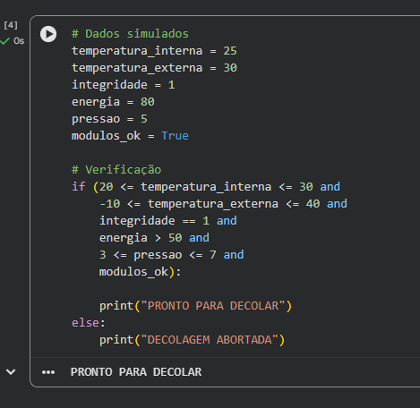

# Sistema de Telemetria para Decolagem

## Descrição
Este projeto simula um sistema de telemetria de uma nave espacial, analisando dados como temperatura, energia, pressão e integridade estrutural para decidir se a nave está pronta para decolagem.

## Lógica
O sistema verifica se todos os parâmetros estão dentro de faixas seguras. Caso estejam, a decolagem é autorizada, caso contrário, é abortada.

## Como executar
1. Abrir o arquivo `.ipynb` no Google Colab ou Jupyter Notebook
2. Executar as células de código
3. Verificar o resultado exibido

## Execução

## Arquivos
- Notebook com o código
- README com explicações

## Projeto desenvolvido para atividade acadêmica de Ciência da Computação.
